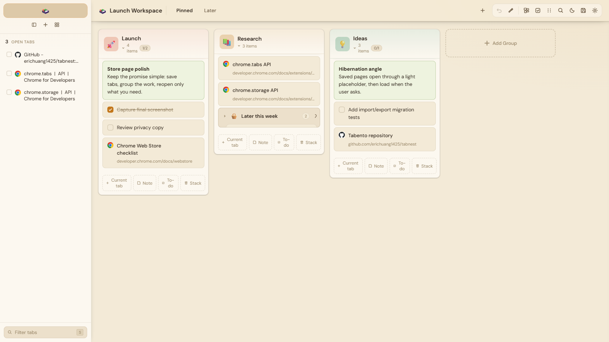

# Tabento

<p align="center"></p>
<p align="center"><strong>Locus Legacy Edition</strong></p>

<p align="center">
  <a href="./manifest.json"></a>
  <a href="./manifest.json"></a>
  <a href="./LICENSE"></a>
  
  
</p>

Tabento is a free, open-source, local-first new-tab workspace for saved tabs, notes, todos, reminders, and lightweight personal trackers. It is the independent legacy predecessor to **Locus**, which is developed separately.

This repository preserves Tabento as a stable, community-friendly extension. Maintenance may include browser compatibility, security fixes, translations, accessibility, and focused community contributions. “Locus Legacy Edition” describes this repository release; the application and interface remain **Tabento**.

## Screenshot



## Features

- Multiple local workspaces with categories, groups, nested stacks, colors, and layouts.
- Saved tabs, notes, todos, reminders, archive, undo/redo, and batch actions.
- Board, list, focused-group, canvas, explorer, timeline, gallery, and graph views.
- Search operators for type, color, domain, URL, location, tags, todo state, and reminders.
- Toolbar popup for saving a tab or complete window and hibernating background tabs.
- Bookmark and pasted-link import plus versioned JSON backup, preview, replace, and merge.
- Pomodoro, finance, subscription, habit, hydration, reading, goal, and workout tools.
- English, Traditional Chinese, Simplified Chinese, Spanish, Japanese, and French locales.
- Local-only storage, no account, no host permissions, and no autonomous page-content access.

## Install

1. Download a release archive or clone this repository.
2. Open `chrome://extensions/` in Chrome or `edge://extensions/` in Edge.
3. Enable **Developer mode**.
4. Choose **Load unpacked** and select the repository directory.
5. Open a new tab.

Release ZIPs contain the same unpacked source; they are not signed browser-store packages.

### Supported browsers

Tabento targets current Chrome and Microsoft Edge through Manifest V3. Firefox is not supported by this release because there is no validated Firefox-specific manifest.

## Development and packaging

Tabento is vanilla JavaScript, HTML, and CSS. There are no dependencies to install, no server, and no generated application bundle.

```powershell
git clone https://github.com/erichuang1425/folio.git
cd folio
node scripts/validate.mjs
./scripts/package.ps1
```

Reload the unpacked extension after edits. Packaging validates the source and creates `dist/tabento-3.1.1.zip`; `dist/` is ignored by Git.

## Data, privacy, and backup

Application data is stored under `te` in `chrome.storage.local`. Tabento has no account or project-operated server and requests no host permissions. Context-menu saves occur only after explicit user action.

Use **Settings → Data → Export** to create a versioned JSON backup. Import previews a file before replace or merge. Exports can contain saved URLs, titles, notes, reminders, and tracker data, so keep them private. See [PRIVACY.md](./PRIVACY.md).

## Languages

| Code | Native name |
| --- | --- |
| `en` | English |
| `zh-TW` | 繁體中文 |
| `zh-CN` | 简体中文 |
| `es` | Español |
| `ja` | 日本語 |
| `fr` | Français |

English is the fallback for missing or invalid locale values. See [docs/TRANSLATING.md](./docs/TRANSLATING.md) to improve translations.

## Project structure

```text
manifest.json          MV3 permissions, commands, icons, and new-tab override
background.js          Context menus, local reminders, and saves
newtab.html/.css/.js   Main Tabento application
popup.html/.css/.js    Toolbar quick-save and hibernation popup
suspended.html/.js     Local hibernated-tab placeholder
themes.css             Shared theme tokens
emoji-data.js          Local emoji picker data
_locales/              Browser/manifest localization
icons/                 Tabento brand and extension icons
docs/                  Public documentation and current screenshot
scripts/               Validation and reproducible packaging
.github/                CI, issue forms, and pull-request template
```

## Contributing and security

Bug fixes, compatibility improvements, translations, accessibility work, documentation, tests, and carefully scoped maintenance features are welcome. Read [CONTRIBUTING.md](./CONTRIBUTING.md) and the [Code of Conduct](./CODE_OF_CONDUCT.md).

Report vulnerabilities privately as described in [SECURITY.md](./SECURITY.md). Use the issue forms for ordinary bugs and feature ideas.

## Versioning and maintenance

Tabento uses semantic versioning for maintained legacy releases. Version `3.1.1` is the first **Locus Legacy Edition** release and is distinct from the historical `3.1.0` snapshot. See [CHANGELOG.md](./CHANGELOG.md) and [RELEASE_NOTES.md](./RELEASE_NOTES.md).

The newer Locus product is maintained separately. A public repository link can be added after it is published.

## License and credits

Copyright © 2026 I-Kai Huang and contributors. Tabento is available under the [MIT License](./LICENSE).

Tabento was independently built with browser platform APIs and vanilla web technologies. The Tabento mark and application artwork are historical project assets. See [THIRD_PARTY_NOTICES.md](./THIRD_PARTY_NOTICES.md).
